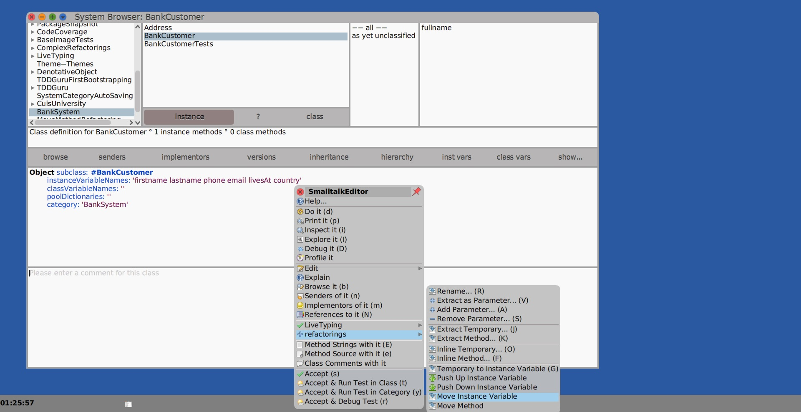
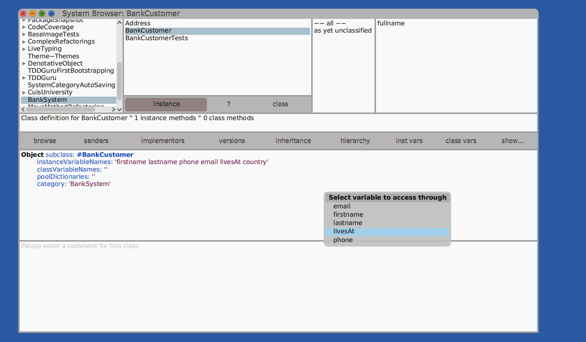
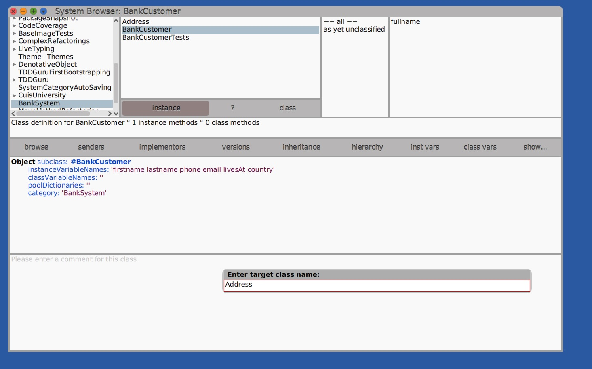
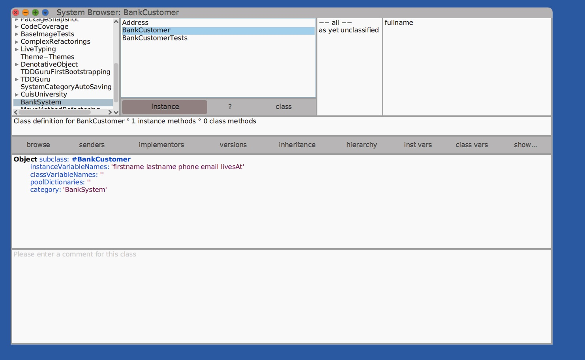

# Move instance variable refactoring for cuis-university

## Introduction

This package provides the move instance variable refactoring AKA [move field refactoring](https://refactoring.guru/move-field)

## Status

All tests are green in CuisUniversity-5655

## Instalation

1. You need to download the lastest image of [cuis-university](https://sites.google.com/view/cuis-university/descargas) 
2. Just install package **MoveInstanceVariableRefactoring.pck.st** like any other
3. Restart VM

## How to use

1. Right click on instance variable name to move and select `refactorings` -> `Move Instance Variable`

2. Select variable to access through

3. Enter the target class where the variable is going to move

4. Done. Your variable is moved and all its references are replaced

